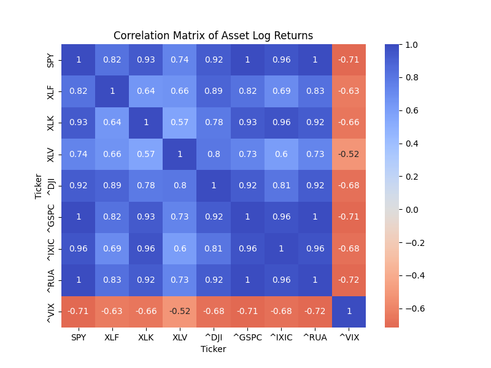
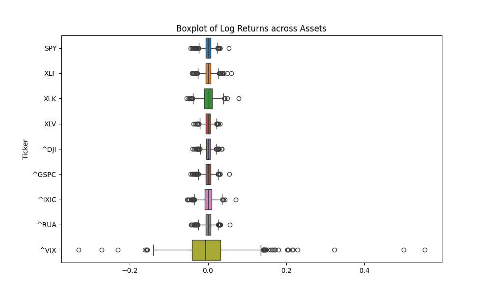

# Quantitative Risk Assessment of Market Volatility Under Macroeconomic Impacts

[](https://python.org)
[](https://streamlit.io)
[](LICENSE)
[](https://www.statsmodels.org/)
[](https://arch.readthedocs.io/)

> **End-to-end quantitative risk pipeline** — data ingestion → statistical diagnostics → ARIMA/GARCH volatility modeling → dynamic 95% VaR → Kupiec backtesting on a $1,000,000 simulated multi-asset portfolio (2022–2024)

---

## Live Interactive Dashboard

This project includes a full **Streamlit web application** — not just a static script.  
Run it locally in seconds:

```bash
git clone https://github.com/DuyThucCao/market-volatility-risk-assessment.git
cd market-volatility-risk-assessment
pip install -r requirements.txt
streamlit run "Python Code/portfolio_app.py"
```

The dashboard has four tabs:

| Tab | What it shows |
|-----|---------------|
| 📊 **Data & Events** | Adjusted close prices + FOMC/CPI/BEA event calendar mapped to trading days |
| 📈 **Statistical Analysis** | Descriptive stats, correlation heatmap, normality test table (Shapiro-Wilk, Jarque-Bera) |
| 🤖 **ARIMA / GARCH Modeling** | On-demand per-asset ARIMA(1,1,0) + GARCH(1,1)-t fitting with conditional volatility chart |
| 🛡️ **Portfolio VaR** | Equal-weight portfolio VaR chart with breach markers + Kupiec test pass/fail metric |

---

## Table of Contents

- [Background](#background)
- [Objectives](#objectives)
- [Data](#data)
- [Methodology](#methodology)
- [Results](#results)
- [Repository Structure](#repository-structure)
- [How to Reproduce](#how-to-reproduce)
- [Future Work](#future-work)
- [Author](#author)

---

## Background

Financial markets are increasingly driven by macroeconomic shocks — FOMC rate decisions, CPI releases, and GDP prints. Traditional risk models assume **normally distributed returns**, which systematically underestimates **tail risk** during periods of market stress.

> **Tail risk** is the risk of extreme losses that occur in the far ends of the return distribution, where rare events happen *more often* than a Normal model predicts. In real markets, returns show fat tails and volatility clustering — meaning under a Normal assumption, risk is routinely understated.

The 2022–2024 period was defined by the most aggressive U.S. rate-hike cycle in four decades: the Fed raised rates **525 bps in 16 months** (March 2022 → July 2023), held at a 23-year peak of 5.25–5.50% for over a year, then began cutting in September 2024. Each FOMC statement shift — from *"ongoing increases appropriate"* to *"holding steady to assess"* to *"gained greater confidence"* — triggered measurable repricing across equities, credit, and volatility.

CPI surprises shift expectations about interest rates and future cash flows, triggering large moves in equities and bonds. FOMC announcements reprice risk across markets by changing discount rates, liquidity conditions, and risk sentiment. Capturing these dynamics requires models that adapt to changing volatility — not static variance assumptions.

This project addresses that by building a reproducible, end-to-end pipeline that:
1. Aligns market data with macroeconomic event calendars (CPI, FOMC, GDP)
2. Validates the statistical properties of returns (stationarity, normality, autocorrelation)
3. Models conditional volatility using GARCH with a **Student-t distribution** to capture fat tails
4. Computes dynamic 95% Value-at-Risk (VaR) and formally backtests it via the **Kupiec POF test**

---

## Objectives

| # | Objective |
|---|-----------|
| 1 | Automate retrieval of price data and map macro events to the nearest trading day |
| 2 | Validate return distributions — stationarity (ADF/KPSS), normality (Shapiro-Wilk, Jarque-Bera, Anderson-Darling), autocorrelation (ACF/PACF) |
| 3 | Fit ARIMA(1,1,0) for trend and GARCH(1,1)-t for conditional volatility per asset and portfolio |
| 4 | Compute dynamic 95% VaR and formally backtest with the Kupiec test |
| 5 | Deliver results through a live Streamlit dashboard |

---

## Data

| Source | Contents | Period |
|--------|----------|--------|
| **Yahoo Finance** (`yfinance`) | Adjusted close prices for SPY, XLK, XLF, XLV, GSPC, DJI, RUA, IXIC, VIX | 2022–2024 |
| **FRED (BEA / BLS)** | CPI, GDP, PCE, and other macro indicators | 2022–2024 |
| **Federal Reserve** | FOMC target rate decisions (525 bps cumulative hikes March 2022–July 2023; −100 bps easing Sep–Dec 2024) | 2022–2024 |

> **Event alignment:** Macro releases often fall on non-trading days. All events are mapped forward to the nearest subsequent trading day using binary search on the trading calendar.

### FOMC Rate Decision Chronology (Primary Sources)

The 24 FOMC press releases included in this repo document the full rate cycle. Key inflection points extracted directly from the statements:

| Date | Decision | Target Range | Cycle Phase | Primary Source Signal |
|------|----------|-------------|-------------|----------------------|
| Jan 26, 2022 | Hold | 0–0.25% | Pre-hike | "Will soon be appropriate to raise" |
| Mar 16, 2022 | **+25 bps** | 0.25–0.50% | Hike begins | "Anticipates ongoing increases appropriate" |
| May 4, 2022 | **+50 bps** | 0.75–1.00% | Accelerating | Balance sheet reduction begins June 1 |
| Jun 15, 2022 | **+75 bps** | 1.50–1.75% | Accelerating | COVID lockdowns in China added to pressures |
| Jul 27, 2022 | **+75 bps** | 2.25–2.50% | Accelerating | "Spending and production have softened" |
| Sep 21, 2022 | **+75 bps** | 3.00–3.25% | Peak tightening | War in Ukraine, supply/demand imbalances |
| Nov 2, 2022 | **+75 bps** | 3.75–4.00% | Peak tightening | "Highly attentive to inflation risks" |
| Dec 14, 2022 | **+50 bps** | 4.25–4.50% | Slowing | First step-down; "cumulative tightening" language |
| Feb 1, 2023 | **+25 bps** | 4.50–4.75% | Terminal approach | Russia/Ukraine uncertainty continues |
| Mar 22, 2023 | **+25 bps** | 4.75–5.00% | Banking stress | First mention: "U.S. banking system is sound and resilient" (SVB) |
| May 3, 2023 | **+25 bps** | 5.00–5.25% | Final hike approach | "Tighter credit conditions likely to weigh on activity" |
| Jun 14, 2023 | Hold | 5.00–5.25% | First pause | "Holding steady allows Committee to assess" |
| Jul 26, 2023 | **+25 bps** | 5.25–5.50% | **Terminal rate** | Last hike of the cycle |
| Sep–Dec 2023 | Hold ×3 | 5.25–5.50% | Plateau | "Does not expect it appropriate to reduce until…" |
| Jan–Jul 2024 | Hold ×5 | 5.25–5.50% | Plateau | "Lack of further progress toward 2% objective" (May) |
| Sep 18, 2024 | **−50 bps** | 4.75–5.00% | **Easing begins** | "Gained greater confidence inflation moving sustainably toward 2%" |
| Nov 7, 2024 | **−25 bps** | 4.50–4.75% | Easing | "Risks to goals are roughly in balance" |
| Dec 18, 2024 | **−25 bps** | 4.25–4.50% | Easing | "Inflation has made progress…remains somewhat elevated" |

**Total tightening: +525 bps (March 2022 → July 2023) · Total easing: −100 bps (September–December 2024)**

The abrupt language shift from *"ongoing increases appropriate"* (2022) → *"holding steady allows assessment"* (June 2023) → *"gained greater confidence"* (September 2024) traces the full policy arc. Each inflection point corresponds to measurable spikes in GARCH-estimated conditional volatility in the portfolio model.

---

## Methodology

### 1. Data Engineering

- Pulled adjusted close prices via `yfinance` for 9 market indices and sector ETFs
- Loaded FOMC target rate history and BEA/BLS macro series from CSV
- Built a trading-day event calendar with binary flags: `FOMC`, `BLS`, `BEA`, `Any_Event`
- Aligned all event dates to the next open trading day

### 2. Statistical Validation

| Test | Purpose | Outcome |
|------|---------|---------|
| ADF (Augmented Dickey-Fuller) | Stationarity of log-returns | Returns are stationary |
| KPSS | Confirm stationarity | Consistent with ADF |
| Shapiro-Wilk | Normality | **Rejected** — fat tails present |
| Jarque-Bera | Skewness + excess kurtosis | **Rejected** — non-normal distribution confirmed |
| Anderson-Darling | Normality (sensitivity to tails) | **Rejected** |
| ACF / PACF | Autocorrelation structure | Significant autocorrelation in squared returns → GARCH needed |

### 3. Modeling

**ARIMA(1,1,0)** on log-prices:
```
Δlog(Pₜ) = c + φ₁·Δlog(Pₜ₋₁) + εₜ
```

**GARCH(1,1) with Student-t innovations** on log-returns:
```
σ²ₜ = ω + α·ε²ₜ₋₁ + β·σ²ₜ₋₁
εₜ  ~ t(ν)     ← fat-tailed; justified by Jarque-Bera / Shapiro-Wilk results
```

The Student-t specification was chosen specifically because all normality tests rejected Gaussian returns, confirming excess kurtosis in the empirical distribution.

### 4. Portfolio Construction

Equal-weight portfolio across SPY, XLK, XLF, XLV:
```
r_portfolio,t = Σ wᵢ · rᵢ,t    where wᵢ = 1/N = 0.25
```

ARIMA and GARCH models are then fit on the portfolio-level return series.

### 5. Risk Metrics & Backtesting

**Dynamic 95% VaR** computed from GARCH conditional volatility:
```
VaR₀.₉₅,t = μ + σₜ · t⁻¹(0.05, ν)
```

**Kupiec Proportion of Failures (POF) Test:**
- **H₀:** Observed breach rate = 5%
- **Test statistic:** Likelihood ratio, χ²(1) distributed
- **Result:** p > 0.05 → Fail to Reject H₀ ✅ — model is statistically valid

---

## Results

### Figure 1 — Non-Normality of S&P 500 Log-Returns

The histogram peaks more sharply than the Normal PDF (left), and the Q-Q plot shows data points diverging from the red line at both extremes (right) — confirming **fat tails** and leptokurtic behavior. This directly justifies the Student-t distribution in GARCH rather than the standard Gaussian assumption.


> VIX shows the most extreme non-normality of all assets — its Q-Q plot deviates dramatically at both tails and its histogram has a pronounced right skew, reflecting the asymmetric nature of fear spikes vs. fear compression.

### Figure 2 — Portfolio Returns vs. 95% GARCH VaR

The red dashed VaR line dynamically expands during the 2022 rate-hike stress period (reaching –2% to –3%) and compresses as conditions stabilized in 2023–2024. The GARCH model's breach frequency was confirmed statistically valid by the **Kupiec POF Test (p > 0.05)** — we fail to reject the null hypothesis that the observed breach rate equals the expected 5%.


### Figure 3 — Correlation Structure

**Full correlation matrix** (all 9 assets × 9 assets):



**Assets vs. market benchmarks** (SPY, XLF, XLK, XLV, IXIC vs. S&P 500, Dow, Russell 3000):


Key correlation findings:
- **VIX is strongly negatively correlated** with every equity index (–0.63 to –0.72), confirming its role as a fear gauge that moves opposite to market direction
- **SPY / GSPC / RUA** are near-perfectly correlated (0.92–1.0) — broad market ETFs track the same systematic risk
- **XLV (Healthcare)** has the lowest correlation with other sectors (0.57–0.73), indicating mild defensive diversification benefit

### Figure 4 — Return Dispersion by Asset

The boxplot reveals that **VIX has by far the widest return distribution** — with outliers stretching from –0.25 to +0.55 — compared to all equity assets, which are tightly clustered near zero. This reinforces why VIX is excluded from the investable portfolio and used solely as a risk indicator.



### Per-Asset Volatility Summary

| Asset | Return Range | Key Observation |
|-------|-------------|----------------|
| **XLK** (Tech) | −6% to +8% | Widest equity range — highest beta to rate hikes; pronounced leptokurtosis at both Q-Q tails |
| **XLF** (Financials) | −4% to +6% | Right-skewed; notable upside spike in late 2024 (rate-cut benefit); heavy left tail around SVB collapse (March 2023) |
| **XLV** (Healthcare) | −4% to +3% | Tightest equity range — most defensive sector; Q-Q plot follows the normal line most closely, though still non-normal |
| **SPY / GSPC** | −4% to +5% | Clear volatility clustering in 2022; calms markedly in 2023–2024 as the rate cycle peaks |
| **VIX** | −25% to +55% | Heavily right-skewed (vol spikes but compression is bounded by zero); extreme fat tails; excluded from investable portfolio |

### Practical Risk Management Implications

These results translate directly into actionable risk management decisions during volatile macro periods:

- **Risk budgeting:** Reduce exposure when GARCH-forecast volatility rises — the model signals elevated risk *before* drawdowns materialize
- **Hedging:** Increase protective hedges (puts, VIX instruments) around CPI and FOMC releases, when model-implied tail risk is elevated
- **Position sizing:** Apply volatility targeting — scale positions inversely with GARCH conditional volatility
- **Leverage and liquidity:** Lower leverage and hold larger cash buffers during event windows to avoid forced liquidation at distressed prices
- **Stress testing:** Supplement VaR with scenario shocks (surprise rate move, equity gap-down), since VaR alone does not quantify the *severity* of losses beyond the threshold — that requires Expected Shortfall

---

## Repository Structure

```
market-volatility-risk-assessment/
│
├── Python Code/
│   ├── market_data.py          # Full analysis pipeline (CLI)
│   └── portfolio_app.py        # Streamlit interactive dashboard
│
├── Dataset/
│   ├── market_data.xlsx        # Adjusted close prices (2022–2024)
│   ├── bea_bls_2022_2024.csv   # BEA/BLS macro indicators
│   └── fomc_2022_2024_rates.csv # FOMC rate decision history
│
├── Fed Press Release/          # Original FOMC press releases (PDF)
│   ├── FED March 2022.pdf
│   └── ...
│
├── Plots:Graphs/               # All generated visualizations (PNG)
│   ├── Time Serie {ticker}.png         # Log-return time series (9 assets)
│   ├── Histogram {ticker}.png          # Return histogram with KDE (9 assets)
│   ├── Normality Check {ticker}.png    # Histogram + Q-Q plot (9 assets)
│   ├── Boxplot.png                     # Return dispersion across all assets
│   ├── Treemap.png                     # Full 9×9 correlation matrix heatmap
│   ├── Treemap 2.png                   # Assets vs. benchmark correlation heatmap
│   └── VaR 95.png                      # Portfolio returns vs. GARCH VaR
│
├── Project Poster.pdf          # Academic research poster
├── Project Presentation.pdf    # Full slide deck
├── requirements.txt
└── README.md
```

---

## How to Reproduce

### Install dependencies

```bash
git clone https://github.com/DuyThucCao/market-volatility-risk-assessment.git
cd market-volatility-risk-assessment
pip install -r requirements.txt
```

**`requirements.txt`**
```
pandas>=2.0
numpy>=1.24
matplotlib>=3.7
seaborn>=0.12
yfinance>=0.2.38
statsmodels>=0.14
arch>=6.2
scipy>=1.11
streamlit>=1.32
openpyxl>=3.1
```

### Option A — Run the interactive Streamlit app (recommended)

```bash
streamlit run "Python Code/portfolio_app.py"
```

Opens in your browser at `http://localhost:8501`. All tabs are live — select assets, adjust the VaR confidence level, and fit models on demand.

### Option B — Run the full analysis pipeline (CLI)

```bash
python "Python Code/market_data.py"
```

Runs all diagnostics, fits ARIMA/GARCH per asset and for the portfolio, generates all plots, and prints the Kupiec test result.

---

## Future Work

- **Asymmetric volatility:** EGARCH or GJR-GARCH to capture the leverage effect (negative shocks increase volatility more than equivalent positive shocks)
- **Expected Shortfall (CVaR):** Complement VaR with the average loss beyond the 95% threshold — addresses VaR's known limitation of ignoring tail shape
- **Multivariate GARCH (DCC):** Model cross-asset volatility spillovers using Dynamic Conditional Correlation — especially relevant for SPY, XLK, and XLF
- **Sentiment integration:** NLP scoring of FOMC press release language as a leading volatility indicator

---

## Author

**Thuc Cao**  
B.S. Data Science, Rutgers University (Expected May 2026)  
Minor in Economics & Statistics

[](https://www.linkedin.com/in/thucduycao/)
[](mailto:duythuccao@outlook.com)
[](https://github.com/DuyThucCao)

*Mentor: Binh Tran · Data: Yahoo Finance, FRED, Federal Reserve*
